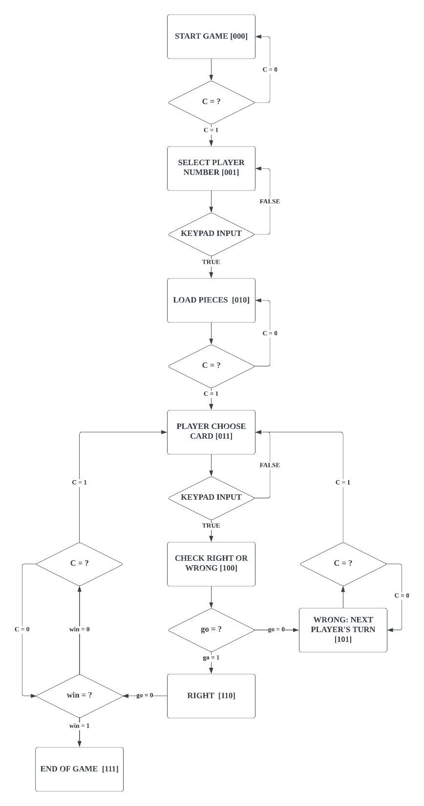
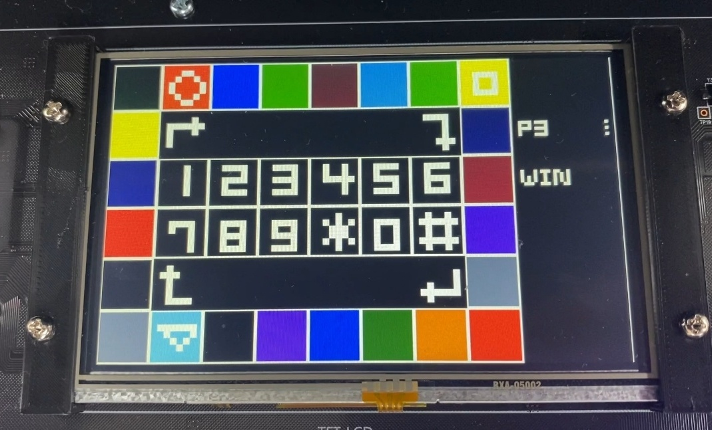

# Implementing Chicken Cha-Cha-Cha Board Game on FPGA
---

This is an undergraduate project that implements the Chicken Cha Cha Cha game on a FPGA using Verilog HDL.

### State Diagram

  <picture>
  
  </picture>
   
  

  <em>State Diagram</em>
  

   

### Block Diagram

  <picture>
  
  </picture>
   
  

  <em>Block Diagram</em>
  

   

  <picture>
  
  </picture>
   
  

  <em>Datapath</em>
  

   

### Implementation

  <picture>
  
  </picture>
   
  

  <em>Implementation Image</em>
  

   

